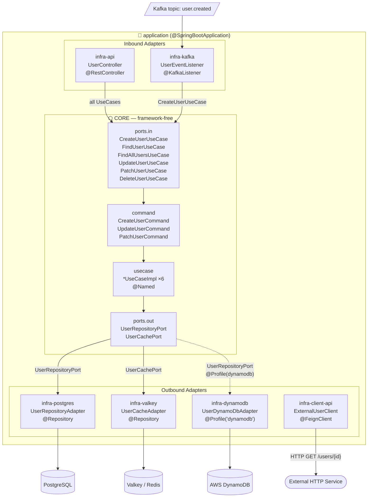

# Architecture Overview

> **Quick-start for AI agents:** Read `TEMPLATE-MANIFEST.json` for the machine-readable scaffold descriptor. Read `AGENTS.md` for strict coding rules. This file is the narrative companion.

---

## The Hexagon



---

## Module Map

| Module | Technology | Role |
|---|---|---|
| `core` | Java 21 std + jakarta.inject | Business rules, domain model, command objects, port contracts |
| `infra-api` | Spring Web MVC + MapStruct | REST inbound adapter (Controllers + DTOs) |
| `infra-postgres` | Spring Data JPA + Hibernate + Lombok | Relational persistence outbound adapter |
| `infra-valkey` | Spring Data Redis | Cache outbound adapter (Valkey-compatible) |
| `infra-kafka` | Spring Kafka + MapStruct | Async messaging inbound/outbound |
| `infra-dynamodb` | Spring Cloud AWS 3.3 + MapStruct | DynamoDB outbound adapter (`@Profile("dynamodb")`) |
| `infra-client-api` | Spring Cloud OpenFeign | Outbound HTTP client integrations |
| `application` | Spring Boot 3.5.0 | Bootstrapper — wires all modules + `application.yml` |

---

## Data-Flow Walkthrough: `POST /api/v1/users`

```
HTTP Request
    │
    ▼
UserController.create(@RequestBody CreateUserRequest)   [infra-api]
    │  UserApiMapper.toCommand(request) → CreateUserCommand
    │
    ▼
CreateUserUseCase.execute(CreateUserCommand)            [core — port contract]
    │
    ▼
CreateUserUseCaseImpl.execute(CreateUserCommand)        [core — @Named impl]
    │  command.name(), command.email()
    │  checks UserRepositoryPort.existsByEmail()
    │  calls   UserRepositoryPort.save(User)
    │  calls   UserCachePort.put(User)
    │
    ├──▶ UserRepositoryAdapter.save()                   [infra-postgres]
    │       UserPostgresMapper: User → UserEntity → save → User
    │
    └──▶ UserCacheAdapter.put()                         [infra-valkey]
             RedisTemplate.set(key, user, TTL from app.cache.user.ttl)
    │
    ▼
UserController returns UserResponse (201 Created)
```

### `GET /api/v1/users/{id}` — cache-first

```
FindUserUseCaseImpl.execute(id)
    │
    ├──▶ UserCachePort.get(id)  → HIT  → return User
    │
    └──▶ UserCachePort.get(id)  → MISS → UserRepositoryPort.findById(id) → return User
```

### `PUT /api/v1/users/{id}` — full replace

```
UserController.update(@PathVariable id, @RequestBody UpdateUserRequest)   [infra-api]
    │  UserApiMapper.toCommand(request) → UpdateUserCommand
    │
    ▼
UpdateUserUseCase.execute(id, UpdateUserCommand)        [core]
    │  UserRepositoryPort.findById(id) → existing User
    │  UserRepositoryPort.save(updated User)
    │
    ▼
UserController returns UserResponse (200 OK)
```

### `PATCH /api/v1/users/{id}` — partial update

```
UserController.patch(@PathVariable id, @RequestBody PatchUserRequest)     [infra-api]
    │  UserApiMapper.toCommand(request) → PatchUserCommand   [null fields ignored via @BeanMapping]
    │
    ▼
PatchUserUseCase.execute(id, PatchUserCommand)          [core]
    │  UserRepositoryPort.findById(id) → existing User
    │  null-coalesce: command.name() != null ? command.name() : existing.name()
    │  UserRepositoryPort.save(merged User)
    │
    ▼
UserController returns UserResponse (200 OK)
```

### Kafka: `user.created` topic

```
UserEventListener.onUserCreated(UserEventPayload)       [infra-kafka — @KafkaListener]
    │
    ▼
CreateUserUseCase.execute(CreateUserCommand)
```

---

## Naming Conventions

| Suffix | Module | Type | Spring annotation |
|---|---|---|---|
| `UseCase` | `core.ports.in` | `interface` | — |
| `UseCaseImpl` | `core.usecase` | `class` | `@Named` (jakarta) |
| `Command` | `core.command` | `record` | — |
| `Port` | `core.ports.out` | `interface` | — |
| `Adapter` | `infra-*` outbound | `class` | `@Repository` / `@Component` |
| `Controller` | `infra-api` | `class` | `@RestController` |
| `Listener` | `infra-kafka` | `class` | `@Component` |
| `Mapper` | `infra-*` mapper pkg | `interface` | `@Mapper(componentModel = SPRING)` |
| `Entity` | `infra-postgres` | `class` | `@Entity` |

---

## Key Architecture Rules

1. **`core` is framework-free** — only `jakarta.inject-api` allowed. No `org.springframework.*`, no `jakarta.persistence.*`, no Jackson.
2. **`@Named` not `@Component`** — use `jakarta.inject.Named` on all `*UseCaseImpl` classes for portable bean discovery.
3. **Constructor injection only** — single constructor with `final` fields; no `@Inject` / `@Autowired` in `core`.
4. **Mappers live in `infra-*`** — always in the `*.mapper` package with `@Mapper(componentModel = SPRING)`.
5. **No extra interfaces on adapters** — `UserRepositoryAdapter` implements `UserRepositoryPort` directly; no `IUserRepositoryAdapter`.
6. **No interfaces on inbound adapters** — `UserController` and `UserEventListener` are concrete classes only.
7. **DynamoDB profile isolation** — `UserDynamoDbAdapter` is `@Profile("dynamodb")`; activating it alongside the Postgres adapter causes a duplicate `UserRepositoryPort` bean.
8. **Lombok scoped to `infra-postgres` only** — JPA entities need mutable boilerplate; all other layers use records or plain classes.
9. **Command objects in `core.command`** — write use cases receive `*Command` records instead of loose parameters. MapStruct in `infra-api` converts Request DTOs → Commands; PATCH uses `@BeanMapping(nullValuePropertyMappingStrategy = IGNORE)` to skip null fields.

---

## How to Add a New Feature (Blueprint Checklist)

Follow this exact order — do not skip steps or create files out of sequence:

```
[ ] 1.  core / domain        — add pure domain record/class (zero annotations)
[ ] 2.  core / command       — add *Command record(s) for write operations
[ ] 3.  core / ports.out     — add *Port interface(s) the use case needs
[ ] 4.  core / ports.in      — add *UseCase interface (receives *Command for writes)
[ ] 5.  core / usecase       — add *UseCaseImpl (@Named, clean constructor)
[ ] 6.  infra-postgres       — add *Entity, extend JpaRepository, add *Mapper, add *Adapter
[ ] 7.  infra-valkey         — add *Adapter if caching is needed
[ ] 8.  infra-dynamodb       — add *DynamoDbEntity (mutable, no Lombok), *Mapper, *Adapter (@Profile)
[ ] 9.  infra-kafka          — add payload record, *Mapper, *Listener if event-driven
[ ] 10. infra-client-api     — add @FeignClient if external HTTP call needed
[ ] 11. infra-api            — add Request/Response records, *Mapper, *Controller
```

> **Violation check:** if any infra class imports from `core.domain` without going through a port, or if `core` imports `org.springframework.*`, stop and flag the inconsistency.

---

## LLM Indexing

| File | Purpose |
|---|---|
| `TEMPLATE-MANIFEST.json` | Root index: stack, replace tokens, naming/mapper/interface rules, module list |
| `{module}/MODULE.json` | Per-module detail: role, packages, keyClasses, config |
| `AGENTS.md` | Prescriptive rules — what to do and what to avoid |
| `ARCHITECTURE.md` | Narrative companion — why the architecture is shaped this way |

---

## Configuration Reference

| Property | Default | Env var override |
|---|---|---|
| `spring.datasource.url` | `jdbc:postgresql://localhost:5432/hexagonal_db` | — |
| `spring.data.redis.host` | `localhost` | `REDIS_HOST` |
| `spring.data.redis.port` | `6379` | `REDIS_PORT` |
| `spring.kafka.bootstrap-servers` | `localhost:9092` | `KAFKA_BOOTSTRAP_SERVERS` |
| `app.cache.user.ttl` | `PT30M` | `USER_CACHE_TTL` |
| `app.kafka.topics.user-created` | `user.created` | — |
| `spring.cloud.aws.region.static` | `us-east-1` | `AWS_REGION` |
| `spring.cloud.aws.dynamodb.endpoint` | _(empty — uses AWS)_ | `DYNAMODB_ENDPOINT` |
| `app.clients.external-user-service.url` | `http://localhost:8081` | `EXTERNAL_USER_SERVICE_URL` |
